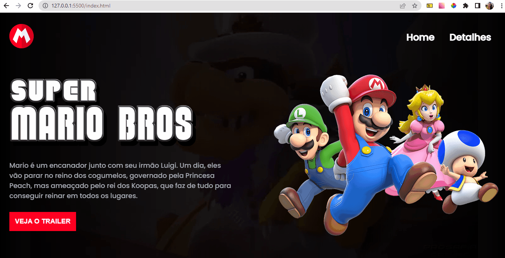

# Projeto Mario Bross

## Descrição
    Projeto realizado com mentoria em video na semana mapa dev week, do Dev em Dobro.

## Meu Processo

    •	Marcação semântica HTML5
    •	Propriedades personalizadas de CSS3
    •	Flexbox 
    •	Design responsivo
    •	JavaScript

## Design

### Desktop e Responsivo

## Autor

 GitHub: <a href="https://github.com/devkarine">DevKarine</a>  
FrontEndMentor: <a href="https://www.frontendmentor.io/profile/devkarine">@devkarine</a>  
CodePen: <a href="https://codepen.io/devkarine">DevKarine</a>  
LinkedIn: <a href="https://www.linkedin.com/in/devkarine/">Karine Pereira</a>